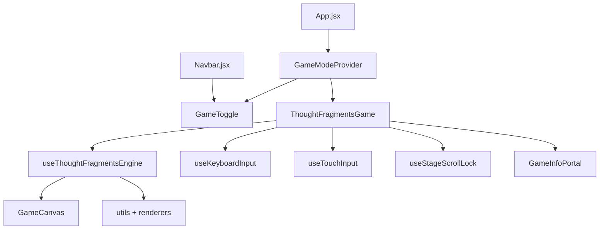

# Thought Fragments — architecture

## Directory layout

```
src/features/thought-fragments/
├── index.js                    # Public exports
├── constants/
│   ├── gameConfig.js           # Physics, counts, feature flags
│   ├── fragments.js            # Stage sections & collectible blueprint
│   ├── colors.js               # Canvas palette
│   └── copy.js                 # User-facing strings & collect quips
├── context/
│   ├── GameModeContext.jsx     # Global game-mode state
│   └── useGameModeContext.js
├── hooks/
│   ├── useThoughtFragmentsEngine.js  # Canvas loop
│   ├── useKeyboardInput.js
│   ├── useTouchInput.js
│   ├── useCoarsePointer.js
│   ├── useReducedMotion.js
│   ├── useStageScrollLock.js
│   └── useFocusTrap.js
├── utils/
│   ├── playArea.js             # Content-column bounds
│   ├── sectionMetrics.js       # Section DOM anchors
│   ├── levelLayout.js          # Seeded random layout + reachability
│   ├── random.js               # Seeded PRNG
│   ├── platforms.js            # Generated ledge collision
│   ├── platformCache.js        # Platform query cache
│   ├── particles.js            # Collect burst simulation
│   └── physics.js              # Movement, drop-through, collection
├── renderers/
│   ├── drawRobot.js
│   ├── drawLightBulb.js
│   ├── drawDoor.js
│   ├── drawPlatform.js
│   └── drawParticles.js
├── components/
│   ├── ThoughtFragmentsGame.jsx
│   ├── GameCanvas.jsx
│   ├── GameContentDim.jsx
│   ├── GameToggle.jsx
│   ├── GameInfoPanel.jsx
│   ├── GameInfoPortal.jsx
│   ├── FragmentCounter.jsx
│   ├── CollectToast.jsx
│   ├── GameStatusOverlay.jsx
│   ├── TouchControls.jsx
│   └── TouchControlButton.jsx
└── styles/                     # CSS modules per component
```

## Data flow



## Integration points

| File | Change |
|------|--------|
| `App.jsx` | Wraps app in `GameModeProvider`; mounts game + mobile toggle |
| `Navbar.jsx` | `data-game-navbar` marker; desktop sidebar toggle |
| `#portfolio-content` | Content wrapper id for layout |

## Level generation

- **Stage:** `#home` → `#about` → `#experience` → `#work`
- **Collectibles:** 4 idea sparks + 1 finish door (5 HUD checkpoints)
- **Randomization:** new seeded layout each time game mode is toggled on
- **Reachability:** vertical stepping spine + horizontal approach chains (ref-inspired)
- **Platforms:** generated ledges only (`USE_DOM_PLATFORMS = false`)

## Performance choices

- **Single `requestAnimationFrame` loop** — game state in refs; no per-frame React re-renders
- **Canvas `pointer-events: none`** — scroll stays native; HUD/buttons capture input
- **Platform cache** — invalidates on resize and scroll bucket changes
- **CSS modules** — scoped styles; z-index layers documented in `components.md`

## Security

- No user-generated content in the game layer
- No external network calls from game code
- Fixed palette and procedural placement only
